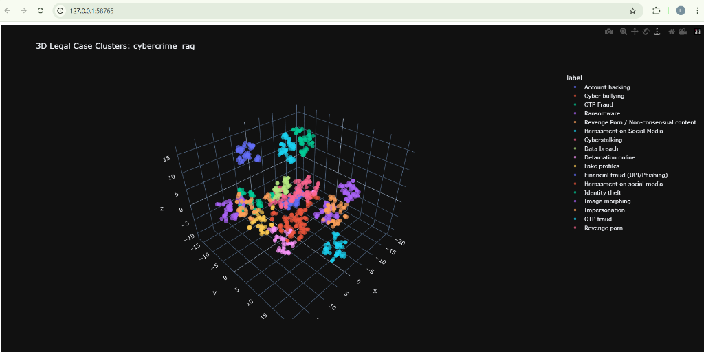
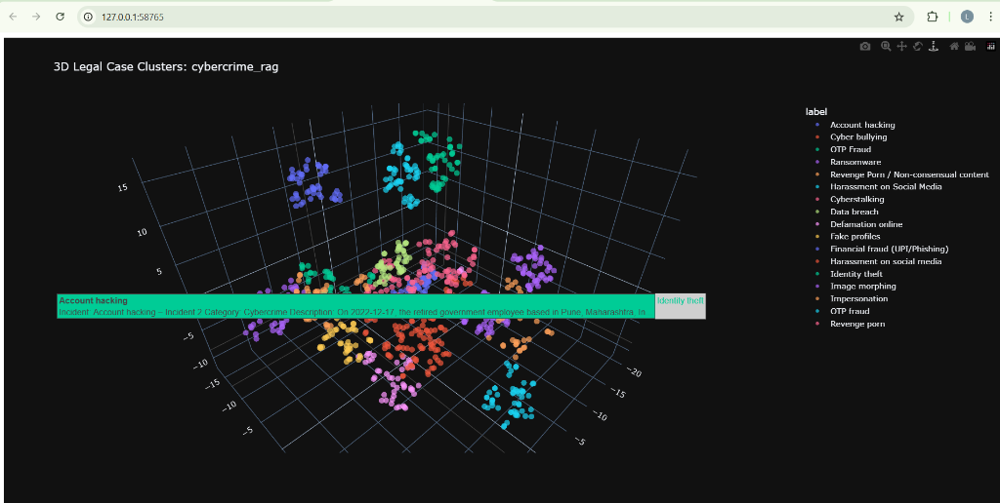

# ⚖️ CyberCrime Legal Assistant

<div align="center">


**An AI-powered legal assistant providing grounded cybercrime guidance using RAG technology**


</div>

---

## 📋 Table of Contents

- Overview
- Features
- System Architecture
- Tech Stack
- Getting Started
  - Prerequisites
  - Installation
  - Configuration
- Usage
- Project Structure
- API Reference
- Dataset
- Acknowledgments

---

## 🎯 Overview

CyberCrime Legal Assistant is a **Retrieval-Augmented Generation (RAG)** system that provides accurate, grounded legal guidance on cybercrime cases. Unlike traditional chatbots, this system retrieves relevant case law from a vector database and generates responses backed by real legal precedents.

### Why RAG?

- **Grounded Responses**: Answers are based on actual case data, not hallucinations
- **Transparent Citations**: Every response includes source case references
- **Up-to-date Information**: Easy to update the knowledge base with new cases
- **Domain-Specific Accuracy**: Specialized for cybercrime legal queries

> **Note**: This system is for educational and informational purposes only. Always consult a qualified legal professional for official legal advice.

---

## ✨ Features

### Core Capabilities

- 🔍 **Semantic Search**: ChromaDB-powered vector search for finding relevant cases
- 🧠 **LLM Reasoning**: Groq (LLaMA 3.3) for natural language generation
- 📚 **Case Citations**: Transparent source attribution with case references
- ⚡ **Fast Inference**: Groq's infrastructure ensures sub-second response times
- 🎨 **Modern UI**: React-based chat interface with dark mode support
- 🎙️ **Multilingual Voice Input**: Speak in English, Hindi, Kannada, or Tamil

### New Features

#### 📄 RTI Application Drafter
- Generate formal RTI (Right to Information) applications in PDF format
- Form 'A' compliant with RTI Rules, 2012
- Preview before download with embedded PDF viewer
- Access via `/rti` route or sidebar link

#### 🚨 Emergency Helpline (1930)
- Prominently displayed for **UPI fraud and financial loss cases only**
- "Golden hour" guidance to freeze fraudulent transactions
- Direct link to [cybercrime.gov.in](https://cybercrime.gov.in/) portal

#### ⚖️ BNS (Bharatiya Nyaya Sanhita) Formatting
- Automatic conversion from old IPC sections to new BNS format
- Display: **"BNS Section 319 (formerly IPC Section 419)"**
- Mapping covers 7 common cybercrime sections

#### 📱 Social Media Grievance Officers
- Contact details for 16 major platforms
- WhatsApp, Facebook, Instagram, X (Twitter), YouTube, Snapchat, LinkedIn, Telegram, Reddit, Discord, Tinder, Bumble, and more
- AI asks which platform if not mentioned, then provides specific officer contact

#### 🗺️ Interactive Map Locators (MapTiler Integration)
- Visual search for the nearest **Cyber Crime Police Stations** and **Legal Aid Providers**.
- Calculate Haversine distance, rendering verified nodes dynamically on an interactive map.
- Real-world curated datasets (`cyberStations.js` and `lawyerData.js`) covering major Indian metropolitan areas.

#### 🎙️ Multilingual Voice Support
- **Voice-to-RAG Engine:** Speak directly to the chatbot in your native language
- **Supported Languages:**
  - 🇬🇧 English
  - 🇮🇳 Hindi (हिन्दी)
  - 🇮🇳 Kannada (ಕನ್ನಡ)
  - 🇮🇳 Tamil (தமிழ்)
- **Real-time Processing:**
  1. Records audio in web browser
  2. Transcribes speech-to-text via backend
  3. Translates to English for legal processing
  4. Generates legal response
  5. Translates response back to native language
  6. Plays back audio response automatically

### Structured Response Format

Every response includes:
1. **🚨 URGENT ACTION** (for financial fraud only)
2. **Case Overview** - Summary of the situation
3. **Legal Analysis** - Table with relevant BNS/IT Act sections
4. **Recommended Next Steps** - Actionable guidance with portal links
5. **Required Evidence** - What to preserve for complaints
6. **Authorities & Jurisdiction** - Where to report

### User Experience

- 💬 Real-time chat interface
- 📝 Context-aware responses with case citations
- 🌓 Dark/Light mode toggle
- 📱 Responsive design
- 💾 Chat history persistence (localStorage)


---

## 🏗️ System Architecture

```
┌─────────────────┐
│   User Query    │
└────────┬────────┘
         │
         ▼
┌─────────────────┐
│  React Frontend │
│   (Chat UI)     │
└────────┬────────┘
         │
         ▼
┌─────────────────┐
│  FastAPI/Flask  │
│   Backend API   │
└────────┬────────┘
         │
         ▼
┌─────────────────┐
│  RAG Pipeline   │
│  rag_pipeline.py│
└────────┬────────┘
         │
    ┌────┴────┐
    ▼         ▼
┌────────┐ ┌──────┐
│ChromaDB│ │ Groq │
│Vector  │ │ LLM  │
│  DB    │ │      │
└────────┘ └──────┘
    │         │
    └────┬────┘
         ▼
  ┌──────────────┐
  │   Response   │
  │ + Citations  │
  └──────────────┘
```

### Pipeline Flow

1. **User Input**: Query submitted via React chat interface
2. **Embedding**: Query converted to vector embedding
3. **Retrieval**: ChromaDB finds top-K most relevant cases
4. **Context Formation**: Retrieved cases formatted as context
5. **Generation**: Groq LLM generates response with citations
6. **Display**: Answer shown in UI with source references

---

## 🛠️ Tech Stack

### Backend
- **Python 3.11+** - Core language
- **ChromaDB** - Vector database for semantic search
- **Groq API** - Ultra-fast LLM inference
- **LLaMA 3.1** - Large language model
- **FastAPI/Flask** - REST API framework
- **SentenceTransformers** - Text embeddings

### Frontend
- **React 18+** - UI framework
- **Vite** - Build tool
- **Tailwind CSS** - Styling
- **Lucide React** - Icons

---

## 🚀 Getting Started

### Prerequisites

- Python 3.11 or higher
- Node.js 18+ and npm
- Git
- Groq API key ([Get one here](https://console.groq.com))

### Installation

#### 1. Clone the Repository

```bash
git clone https://github.com/yourusername/legalchatbot.git
cd legalchatbot
```

#### 2. Backend Setup

```bash
# Create virtual environment
python -m venv .venv

# Activate virtual environment on Windows:
.venv\Scripts\activate
# On macOS/Linux:
source .venv/bin/activate

# Install dependencies
pip install -r requirements.txt
```

#### 3. Frontend Setup

```bash
cd frontend
npm install
```

#### 4. Environment Configuration

Create a `.env` file in the root directory:

```env
GROQ_API_KEY=your_groq_api_key_here
CHROMA_DB_PATH=./cyber_crime_db
MODEL_NAME=llama-3.1-70b-versatile
```

#### 5. Data Ingestion

```bash
# Run from project root
python backend/app/rag/ingest.py
```

This will:
- Load cases from `data/cases.json`
- Generate embeddings
- Store vectors in ChromaDB

---

## 💻 Usage

### Development Mode

**Terminal 1 - Backend:**
```powershell
# Windows PowerShell
cd backend
& "../.venv/Scripts/activate.ps1"
$env:PYTHONPATH = "C:\path\to\cybercrime-rag-system\backend"
python -m uvicorn app.main:app --host 127.0.0.1 --port 5000 --reload
```

```bash
# macOS/Linux
cd backend
source ../.venv/bin/activate
export PYTHONPATH=$(pwd)
uvicorn app.main:app --host 127.0.0.1 --port 5000 --reload
```

**Terminal 2 - Frontend:**
```bash
cd frontend
npm run dev
```

### Access Points

| Route | Description |
|-------|-------------|
| `http://localhost:5173` | Landing Page |
| `http://localhost:5173/chat` | Legal AI Chatbot |
| `http://localhost:5173/rti` | RTI Application Drafter |
| `http://localhost:5000/` | Backend Health Check |
| `http://localhost:5000/docs` | API Documentation (Swagger) |

### CLI Testing

Test retrieval only:
```bash
python backend/app/rag/query.py "What are the penalties for UPI fraud?"
```

Test full RAG pipeline:
```bash
python backend/app/rag/rag_pipeline.py "Someone hacked my Instagram account"
```

---

## 📁 Project Structure

```
LEGALCHATBOT/
│
├── backend/
│   ├── app/
│   │   ├── rag/
│   │   │   ├── __init__.py
│   │   │   ├── glue.py              # ChromaDB connection
│   │   │   ├── ingest.py            # Data ingestion pipeline
│   │   │   ├── llm.py               # Groq LLM integration
│   │   │   ├── query.py             # Retrieval module
│   │   │   └── rag_pipeline.py      # Main RAG logic
│   │   ├── __init__.py
│   │   └── main.py                  # FastAPI/Flask app
│   ├── cyber_crime_db/              # ChromaDB storage
│   └── chroma_db/
│
├── data/
│   └── cases.json                   # Cybercrime case dataset
│
├── frontend/
│   ├── src/
│   │   ├── api/
│   │   │   └── Client.js            # API client
│   │   ├── components/
│   │   │   ├── Message.jsx          # Chat message component
│   │   │   ├── VoiceInput.jsx       # Voice recording component
│   │   │   └── ...                  # Other UI components
│   │   ├── pages/
│   │   │   ├── Chat.jsx             # Main chat page
│   │   │   ├── landing.jsx          # Landing page
│   │   │   └── RTIForm.jsx          # RTI Application Drafter
│   │   ├── App.jsx
│   │   └── main.jsx
│   ├── public/
│   ├── index.html
│   ├── package.json
│   └── vite.config.js
│
├── .env                             # Environment variables
├── .gitignore
├── requirements.txt                 # Python dependencies
└── README.md
```

---

## 🔌 API Reference

### Base URL
```
http://localhost:5000/api
```

### Endpoints

#### POST `/ask`
Get legal guidance on a cybercrime query.

**Request:**
```json
{
  "question": "I lost money in a UPI fraud. What should I do?",
  "top_k": 5
}
```

**Response:**
```json
{
  "answer": "Based on relevant case law, you should immediately...",
  "sources": [
    "IPC Section 420 - Cheating and Dishonesty",
    "IT Act 2000 Section 66D - Punishment for cheating by personation"
  ],
  "context_used": 5
}
```

#### GET `/health`
Check API health status.

**Response:**
```json
{
  "status": "healthy",
  "database": "connected",
  "model": "llama-3.1-70b-versatile"
}
```

---

## 📊 Dataset

The system uses a curated dataset of cybercrime cases stored in `data/cases.json`.

### Schema

```json
{
  "case_id": "CC001",
  "title": "UPI Fraud Case",
  "category": "financial_fraud",
  "description": "Victim lost ₹50,000 through unauthorized UPI transaction...",
  "relevant_laws": ["IPC 420", "IT Act 66D"],
  "verdict": "Guilty - 2 years imprisonment + ₹1,00,000 fine",
  "precedent": "Similar cases should report to cybercrime cell within 24 hours"
}
```

### Data Sources

> **Important**: The dataset is compiled from publicly available cybercrime case summaries for educational and research purposes only.

---

## 📈 Vector Embedding Visualizations

The RAG system uses **SentenceTransformers** to generate vector embeddings for each legal case, enabling semantic similarity search. Below are 3D visualizations of how the embeddings cluster by crime category using t-SNE dimensionality reduction.

### 3D Legal Case Clusters



*The visualization shows distinct clusters for different cybercrime categories: Account hacking, Cyber bullying, OTP Fraud, Ransomware, Data breach, Financial fraud (UPI/Phishing), Identity theft, Image morphing, and more.*

### Interactive Case Explorer



*Hover over any point to see case details including Incident ID, Category, and Description. This demonstrates how semantically similar cases are grouped together in the vector space.*

### Key Insights

- **Clear Separation**: Different crime types form distinct clusters
- **Semantic Similarity**: Cases with similar legal implications are positioned closer together
- **Effective Retrieval**: This clustering enables accurate retrieval of relevant precedents for user queries

---

### Coding Standards

- Follow PEP 8 for Python code
- Use ESLint/Prettier for JavaScript
- Write meaningful commit messages
- Add tests for new features
- Update documentation


##  Acknowledgments

- **ChromaDB Team** - For the excellent vector database
- **Groq** - For providing fast LLM inference
- **Meta AI** - For the LLaMA model
- **Indian Legal Community** - For publicly available case data


<div align="center">

**[⬆ Back to Top](#-cybercrime-legal-assistant)**

Made with ❤️ for legal tech innovation

</div>